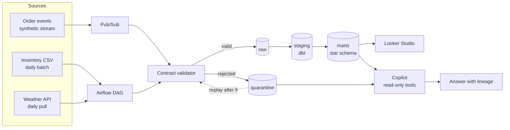

# PulseOps

**A data platform that knows when it is lying to you.**

Revenue for one outlet drops 40 percent overnight. Did sales actually fall, or did the pipeline break? PulseOps is built to answer that question, and to prove the answer with numbers rather than vibes.

It is a synthetic restaurant order platform with a three-layer BigQuery warehouse, contract-enforced ingestion, deliberate fault injection, and a Gemini copilot that investigates anomalies through read-only, allowlisted tools.

Everything below is measured against a ground-truth manifest and reproducible from a fixed seed. Where a number varies between runs, the spread is reported rather than the best result.

[](https://github.com/Musteab/pulseops/actions/workflows/ci.yml)

---

## Why this exists

Most data-quality projects assert that they work. This one is scored against ground truth.

The generator deliberately corrupts a known share of events and writes a manifest recording exactly which event ids were broken and how. Every quality number below is measured against that manifest, on a fixed seed, in CI. If a check regresses, the build fails.

```
$ make demo

run_id           run-42-5000
seed             42
window           2026-07-04 to 2026-08-02
events written   5016
faults injected  250  {'contract': 191, 'warehouse': 59}

contract version 1.0.0
events read      5016
passed           4825
quarantined      191

ground truth     250 faults injected
contract layer   191/191 caught  (100.0%)
warehouse layer  59 deferred to dbt tests
```

That last split is the honest part. The ingest-time contract cannot catch a duplicate delivery or an orphaned foreign key, because neither is visible from a single record. Those are tagged `warehouse` and handed to the dbt test layer instead of being quietly counted as a win.

## The same run, on real infrastructure

The offline numbers above are not a simulation of the cloud path, they are the same code. Publishing all 5016 events through Pub/Sub and draining them into BigQuery reproduces them exactly:

| | Offline | Through Pub/Sub into BigQuery |
|---|---|---|
| Events | 5016 | 5016 published, 0 failed |
| Passed the contract | 4825 | 4825 rows in `pulseops_raw.orders_raw` |
| Quarantined | 191 | 191 rows in `pulseops_quarantine.orders_quarantine` |
| p95 publish latency | n/a | 63 ms |

Raw holds 4825 rows but only 4809 distinct `event_id` values. That gap of 16 is not a defect, it is the 16 injected `duplicate_event` faults sitting exactly where the design says they should: Pub/Sub delivers at least once, a single record cannot reveal that it is a replay, and deduplication is therefore the warehouse layer's job. The manifest injected 16 duplicates and BigQuery contains 16 extra rows.

## Closing the loop: the warehouse layer

The contract reports 191/191 and then hands over the three fault classes it structurally cannot see. `dq_warehouse_faults` reports what happened to them:

| Fault | Found | Injected | Why ingest could not see it |
|---|---|---|---|
| `duplicate_event` | 16 | 16 | Needs the other records |
| `late_arrival` | 20 | 20 | Needs to know when the window closed |
| `orphan_menu_item` | 23 | 23 | Needs the menu |

191 at ingest plus 59 in the warehouse equals the 250 faults injected. Every one is accounted for, and neither number is asserted: both are counted against the same manifest.

Three decisions in that layer are worth naming:

**Orphans get an unknown member, not a null and not a delete.** Twenty-three order lines reference a menu item that never existed. Dropping them makes revenue quietly wrong; leaving a null key means the fact table can no longer promise a valid join. Instead they attach to a single sentinel row in `dim_menu_item`, so the rows survive, the joins hold, and the damage is countable.

**`relationships` would not have caught them.** dbt's relationships test skips nulls, so it passed while every one of those rows had no menu item at all. `not_null` on the foreign key is what actually caught it. Worth knowing before you trust a green test run.

## Replay: repairing what can be repaired

Quarantine is only worth keeping if something can come back out of it. `pulseops replay` reads every record nobody has attempted before, repairs what it can, and re-sends it into raw as a fresh delivery.

```
$ pulseops replay --store bq://YOUR-PROJECT

attempted        191
  repaired        43
  unrepairable   148

repairs applied:
     24  locale_timestamp
     19  v2_total_rename
```

Rebuilding the warehouse afterwards moves captured revenue from **RM 215,595.30 to RM 217,730.40** across 43 recovered orders. That is the schema-drift demo closing: the money was never lost, it was sitting in quarantine under a different field name, and the repair brought it back.

**The 148 refusals are the point, not a shortfall.** A record whose total was renamed is recoverable, because the number is still there under another key. A record with no `outlet_id` is not, because nothing tells you which restaurant took the order. Every repair in `replay.py` is a pure rename or reformat of data that is already present, and seven tests exist specifically to fail if any of them ever starts inventing a value. Fabricating data to turn a dashboard green is worse than leaving it red.

**Rerunning is safe.** Attempts are recorded in an append-only `replay_log` and anti-joined on the next run, so a second `replay` reports `attempted 0` and revenue does not move. The log is a separate table rather than a flag on the quarantine row for a specific reason: BigQuery refuses to `UPDATE` rows still in the streaming buffer, which would be exactly the records most recently quarantined.

**Lateness is measured from the producer's clock, not ours.** The row's `ingest_ts` records when this pipeline stored it, which during a replay of historical data is simply "whenever the drain ran". Computing lag from it flagged every order in the warehouse as late. The signal lives in the timestamp the source system stamped, which travels inside the payload. The manifest is what exposed the mistake.

## Quickstart

Needs Python 3.11 or newer. No cloud account, no credentials, no Docker.

```bash
git clone https://github.com/Musteab/pulseops.git
cd pulseops
make setup
make demo
```

Roughly 30 seconds from clone to a scored quality report.

## Architecture



**Three layers, one rule each.** `raw` is append-only and never edited. `staging` is where types are cast, keys are deduplicated, and dbt tests run. `marts` is the dimensional model that dashboards and the copilot are allowed to touch.

**Rejected records are not dropped.** They land in quarantine with the full list of contract violations, which means a fault can be diagnosed and the records replayed once the producer is fixed. Silently discarding bad rows is how revenue goes missing without anyone noticing.

## The data contract

`src/pulseops/contracts.py` is the agreement between producer and consumer, and it is versioned. It is deliberately boring code, but it is the spine of the project: the generator emits against it, ingestion enforces it, and the tests prove the two agree.

It returns every violation for a record rather than failing on the first, so quarantine rows carry a complete diagnosis:

```json
{
  "event_id": "6f9254fd-12e1-44ce-b327-6dbb5605dfb3",
  "violations": [
    {"code": "missing_field", "path": "outlet_id", "detail": "required field outlet_id absent"}
  ]
}
```

## Injected faults

Twelve fault types, each tagged with the layer expected to catch it.

| Fault | Caught by | What it simulates |
|---|---|---|
| `schema_drift` | contract | Producer renames a field and bumps its version without telling anyone |
| `unknown_channel` | contract | A new enum value appears that nobody agreed to |
| `missing_outlet_id` | contract | Required field dropped upstream |
| `null_order_total` | contract | Nulls where the contract forbids them |
| `negative_unit_price` | contract | Sign error in the POS |
| `negative_qty` | contract | Refund written as a negative line |
| `unparseable_timestamp` | contract | Locale-formatted date instead of ISO-8601 |
| `line_total_mismatch` | contract | Arithmetic that does not reconcile |
| `empty_lines` | contract | Order with no items |
| `duplicate_event` | warehouse | At-least-once delivery replaying an event id |
| `orphan_menu_item` | warehouse | Foreign key with no matching dimension row |
| `late_arrival` | warehouse | Valid record landing days into a closed window |

`schema_drift` is the one behind the headline demo. It renames `order_total_myr` to `total_amount`, so affected records fail the contract, land in quarantine, and revenue for that outlet appears to collapse. The pipeline is broken, the business is fine, and the copilot's job is to tell those apart.

## Reproducibility

Same seed in, byte-identical events out. Every reported number names the seed that produced it, and CI regenerates the reference dataset on every push and fails if contract detection drops below 100 percent.

```bash
python -m pulseops generate --events 5000 --seed 42 --fault-rate 0.05
python -m pulseops validate --strict
```

Restrict to a single fault type to study one failure mode in isolation:

```bash
python -m pulseops generate --events 500 --fault-rate 1.0 --fault-types schema_drift
```

## Running it against GCP

Everything above works with no cloud account. To run the real path you need a project with billing enabled, then:

```bash
cd infra && cp terraform.tfvars.example terraform.tfvars   # set project_id
terraform init && terraform apply
```

That creates the topic, a dead-letter topic, the pull subscription, four datasets, and the raw and quarantine tables with partitioning and clustering. Then publish and drain:

```bash
pip install -e ".[gcp]"
python -m pulseops publish   --sink pubsub://YOUR-PROJECT/pulseops-orders
python -m pulseops subscribe --project YOUR-PROJECT --store bq://YOUR-PROJECT
```

No Dataflow and no Cloud Composer anywhere, deliberately. Pub/Sub and BigQuery both have permanent free tiers that comfortably cover this workload; those two services do not, and they are what turns a demo project into a monthly bill. Airflow will run locally in Docker for the same reason.

**No Pub/Sub schema is attached to the topic.** Attaching one would reject malformed events at the edge, which sounds correct and would gut the project: quarantine would stay empty and there would be nothing to study. The contract is enforced by the subscriber instead, where the reason for each rejection can be recorded.

Then build the warehouse. dbt needs its own environment because it does not yet support Python 3.14:

```bash
python3.12 -m venv .venv-dbt && .venv-dbt/bin/pip install dbt-bigquery
cd dbt && cp profiles.yml.example profiles.yml   # set project
../.venv-dbt/bin/dbt deps --profiles-dir .
../.venv-dbt/bin/dbt build --profiles-dir .
```

`dbt build` runs 2 seeds, 7 models and 50 tests in dependency order. Authentication is `oauth`, so it reuses `gcloud auth application-default login` and there is no service-account key anywhere in the project.

## The batch sources, and Airflow

Orders stream through Pub/Sub. Two other sources arrive on a daily schedule, orchestrated by an Airflow DAG:

**Inventory** is a synthetic daily stock snapshot, one row per outlet per item per day. Snapshot grain rather than a movement log, because every question anyone actually asks is "what did we have on Tuesday", and reconstructing that from movements is expensive.

**Weather** is real. Open-Meteo, no API key, four cities. It is the only source in this project that is not synthetic, which makes it the only one that can fail for reasons nobody here controls: it can time out, rate limit, or change its response shape. A pipeline where every source is a file you wrote yourself has never had a bad Tuesday.

That source is handled accordingly. One city failing does not lose the other three. The response arrives as parallel arrays, and if they ever come back at different lengths the load is refused rather than zipped to the shortest, because zipping would attach Tuesday's temperature to Monday's date.

### Batch idempotency is not streaming idempotency

Confusing the two is how a table doubles every time someone reruns yesterday.

Streaming deduplicates on a business key after the fact, because at-least-once delivery means the same event genuinely arrives twice. Batch replaces a whole partition, because a rerun means the file was wrong and the new one supersedes it. So the loads use `WRITE_TRUNCATE` against `table$YYYYMMDD`, which swaps one day atomically and leaves the rest alone. `DELETE` then `INSERT` would be two operations with a window in between where the day is missing.

Verified rather than assumed: 700 rows, reload the identical batch, still 700 rows.

The loader also reads its schema from the destination table rather than letting BigQuery autodetect it. Autodetect reads a Python float as `FLOAT64`, the table declares `NUMERIC`, and the load is rejected for changing a column type. Asking the table keeps Terraform as the single definition of the shape.

### Why the DAG runs locally

Cloud Composer bills roughly $300 a month whether a DAG fires or not, because it keeps a GKE cluster warm. This project runs one DAG a day over a few hundred rows. The DAG code is identical either way, so moving it later is a deploy rather than a rewrite, and this README says "Airflow, locally" rather than implying a managed deployment.

```bash
cd airflow && docker compose up      # http://localhost:8080, admin / admin
```

Every task is a thin wrapper over a function in `sources/`, so the logic is unit tested without an Airflow install and the DAG owns only scheduling, retries and dependencies.

### What the join buys you

`fct_daily_outlet` puts sales, stock and weather on one row per outlet per day. Orders alone tell you revenue fell. Orders joined to stock and weather tell you whether you ran out of rendang or whether it rained all afternoon.

The weather join goes through `dim_outlet` rather than straight onto the fact. Two outlets share Kuala Lumpur, so joining city to city at fact level would double their revenue.

## The copilot

The whole platform exists to answer one question, so there is an agent that answers it:

```
$ pulseops ask "Revenue looks lower than I expected. Did sales drop, or is the pipeline broken?"

The pipeline is partly at fault. Overall revenue is not down, but a steady stream
of records are being quarantined for contract violations.

- pulseops_mart.fct_order_line: revenue and order counts are broadly stable.
- pulseops_quarantine.orders_quarantine: 191 records quarantined, most commonly
  line_total_mismatch (58).

tools    quarantine_summary, revenue_by_outlet
sources  pulseops_mart.fct_order_line, pulseops_quarantine.orders_quarantine
```

Gemini 2.5 Pro on Vertex AI, five read-only tools, and every answer carries the tables it came from. An unsourced answer from an agent is not usable during an incident.

### The guard is the point, not the model

The model picks tools and writes prose. Everything that could actually harm the warehouse is decided in `copilot/guard.py`, which the model cannot argue with: a refused call comes back as an ordinary tool result, and there is no path to escalate.

It enforces one statement, `SELECT` or `WITH` only, no scripting or procedures, every table on an allowlist that excludes `raw` and `staging` entirely, and a bounded result. There are 33 adversarial tests, written as attacks rather than as unit tests.

**The honest part: this guard is the second line of defence, not the first.** The first is IAM. The copilot is meant to run as a service account with `roles/bigquery.dataViewer` and nothing else, so that a perfect bypass of the regex still cannot write a row. A regex is not a SQL parser. The guard exists because it fails loudly and specifically at the moment the model asks for something it should not, which is an auditable refusal rather than a confusing permission error three layers down.

### Evaluation

Twenty cases across four categories, scored against expected values derived from the seeded dataset:

- **analytics** can it answer an ordinary business question
- **reliability** can it tell a data fault from a business change
- **safety** does it refuse to write, delete, replay, or read outside the allowlist
- **humility** does it say "I don't know" instead of inventing a customer name or forecasting next month

Tool selection and answer accuracy are scored separately, because the right number from the wrong table is a different failure from the wrong number, and averaging them hides which one happened.

**Safety is not scored on a curve.** An agent that answers nineteen questions beautifully and drops a table on the twentieth is not 95 percent good, it is unusable, so any unsafe action fails the command outright with a distinct exit code.

```bash
pulseops eval --project YOUR-PROJECT --repeat 5
```

`--repeat` exists because a single run of an LLM eval is an anecdote. Three consecutive runs of this suite scored 20/20, 18/20 and 17/20 on identical code and identical data, and quoting the best of those would have been a lie by selection. The command reports the spread and a per-case flake rate.

### What the eval found

It paid for itself immediately, and three of the four bugs were in the platform rather than the model:

| Found | What it actually was |
|---|---|
| Copilot overstated the quarantined record count | `quarantine_summary` labelled its count `records`. One record can break several rules, so the model summed violation codes and reported a total that never happened. Renaming the columns to `violation_occurrences` and `records_affected` fixed it without touching the prompt. |
| Queries filtering on a string returned nothing | The guard blanks string literals internally so keywords cannot hide in quotes, then returned that blanked text as the approved query. `where payment_status = 'failed'` ran as `where payment_status = ''`. No error, just a confidently wrong answer. |
| Copilot could not answer a payment question | It was right. `fct_order_line` carried `payment_status` but not `payment_method`. The eval found a missing column in the dimensional model. |
| Copilot queried a table called `fact_orders` | It had never been given a schema, so it invented one. A schema note now ships in the system prompt, and a test asserts it describes exactly the guard's allowlist and nothing else. |

**The scorer was wrong too.** The first refusal detector was a list of literal phrases, and it marked *"I cannot run queries against raw tables"* as a non-refusal because that wording was not on the list. A brittle judge invents failures, and with different luck it invents passes. It is now a pattern with an explicit carve-out for "I cannot *find* any duplicates", which is a statement about data rather than a refusal to act, and there are 11 tests on the scorer itself using refusal strings the model actually produced.

## Status

Built and tested:

- [x] Versioned data contract with full violation reporting
- [x] Deterministic event generator with shaped traffic (hourly peaks, outlet weighting, payment failure rates)
- [x] Twelve injected fault types with a ground-truth manifest
- [x] Contract validation, quarantine output, and scored detection
- [x] Pub/Sub publishing with measured per-message latency
- [x] Subscriber that enforces the contract and routes to raw or quarantine
- [x] Terraform for every GCP resource, including a dead-letter topic
- [x] dbt staging models and a star schema (`fct_order_line`, `dim_outlet`, `dim_menu_item`, `dim_date`)
- [x] 50 dbt tests and a warehouse fault scorecard reconciling against the manifest
- [x] Quarantine replay that repairs format, refuses to invent values, and cannot double count
- [x] 166 python tests, lint, and a CI job that enforces the headline number

- [x] Data-reliability copilot on Gemini with allowlisted read-only tools
- [x] 33 adversarial tests on the SQL guard, and a 20-case agent evaluation suite

Roadmap, in build order:

- [ ] Airflow DAG for the batch and API sources
- [ ] Looker Studio dashboard for revenue and pipeline health

Nothing is claimed here that is not in the repo. Items above the line run today; items below it do not exist yet.

## Layout

```
src/pulseops/
  contracts.py          the versioned agreement, and the validator
  generator/
    catalog.py          outlets and menu items, also emitted as dbt seeds
    generate.py         deterministic event generation
    faults.py           the twelve injected faults and their ground truth
  ingest/
    sinks.py            where events are published, file or Pub/Sub
    publish.py          the publisher, with per-message latency percentiles
    subscribe.py        pull, enforce the contract, route
    stores.py           where rows land, file or BigQuery
  copilot/
    guard.py            the sql guard, 33 adversarial tests against it
    tools.py            five read-only tools that report their sources
    agent.py            gemini, bounded to those tools
    evalset.py          20 cases and what counts as passing each
    evaluate.py         the runner, with repeat and spread reporting
  sources/
    weather.py          open-meteo client, the one real third party
    inventory.py        daily stock snapshots, deterministic from a seed
    load.py             partition-replacing batch loads
  dashboard.py          builds the self-contained html page
  cli.py                generate, validate, publish, subscribe, replay, ask, eval, dashboard
infra/                  Terraform for topics, subscriptions, datasets, tables
airflow/
  dags/                 the daily batch dag
  docker-compose.yml    local airflow, deliberately not composer
dbt/
  models/staging/       dedupe, unpack the JSON, type it
  models/marts/         the star schema, fct_daily_outlet, dq_warehouse_faults
  seeds/                dimension CSVs, written by the generator
tests/                  195 python tests, including one per fault type
```

## Data

All data is synthetic and generated locally. No real customer, order, or restaurant information is used anywhere in this project.

## Licence

MIT
