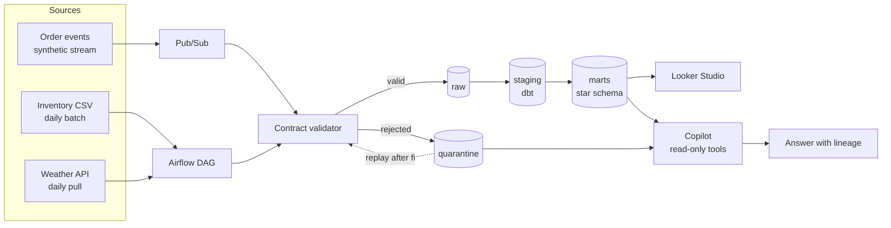

# PulseOps

**A data platform that knows when it is lying to you.**

Revenue for one outlet drops 40 percent overnight. Did sales actually fall, or did the pipeline break? PulseOps is built to answer that question, and to prove the answer with numbers rather than vibes.

It is a synthetic restaurant order platform with a three-layer BigQuery warehouse, contract-enforced ingestion, deliberate fault injection, and (in progress) an agentic copilot that investigates anomalies with read-only tools.

[](https://github.com/Musteab/pulseops/actions/workflows/ci.yml)

---

## Why this exists

Most data-quality projects assert that they work. This one is scored against ground truth.

The generator deliberately corrupts a known share of events and writes a manifest recording exactly which event ids were broken and how. Every quality number below is measured against that manifest, on a fixed seed, in CI. If a check regresses, the build fails.

```
$ make demo

run_id           run-42-5000
seed             42
window           2026-06-30 to 2026-07-29
events written   5022
faults injected  250  {'contract': 185, 'warehouse': 65}

contract version 1.0.0
events read      5022
passed           4837
quarantined      185

ground truth     250 faults injected
contract layer   185/185 caught  (100.0%)
warehouse layer  65 deferred to dbt tests
```

That last split is the honest part. The ingest-time contract cannot catch a duplicate delivery or an orphaned foreign key, because neither is visible from a single record. Those are tagged `warehouse` and handed to the dbt test layer instead of being quietly counted as a win.

## The same run, on real infrastructure

The offline numbers above are not a simulation of the cloud path, they are the same code. Publishing all 5022 events through Pub/Sub and draining them into BigQuery reproduces them exactly:

| | Offline | Through Pub/Sub into BigQuery |
|---|---|---|
| Events | 5022 | 5022 published, 0 failed |
| Passed the contract | 4837 | 4837 rows in `pulseops_raw.orders_raw` |
| Quarantined | 185 | 185 rows in `pulseops_quarantine.orders_quarantine` |
| p95 publish latency | n/a | 67 ms |

Raw holds 4837 rows but only 4815 distinct `event_id` values. That gap of 22 is not a defect, it is the 22 injected `duplicate_event` faults sitting exactly where the design says they should: Pub/Sub delivers at least once, a single record cannot reveal that it is a replay, and deduplication is therefore the warehouse layer's job. The manifest injected 22 duplicates and BigQuery contains 22 extra rows.

## Closing the loop: the warehouse layer

The contract reports 185/185 and then hands over the three fault classes it structurally cannot see. `dq_warehouse_faults` reports what happened to them:

| Fault | Found | Injected | Why ingest could not see it |
|---|---|---|---|
| `duplicate_event` | 22 | 22 | Needs the other records |
| `late_arrival` | 26 | 26 | Needs to know when the window closed |
| `orphan_menu_item` | 17 | 17 | Needs the menu |

185 at ingest plus 65 in the warehouse equals the 250 faults injected. Every one is accounted for, and neither number is asserted: both are counted against the same manifest.

Three decisions in that layer are worth naming:

**Orphans get an unknown member, not a null and not a delete.** Seventeen order lines reference a menu item that never existed. Dropping them makes revenue quietly wrong; leaving a null key means the fact table can no longer promise a valid join. Instead they attach to a single sentinel row in `dim_menu_item`, so the rows survive, the joins hold, and the damage is countable.

**`relationships` would not have caught them.** dbt's relationships test skips nulls, so it passed while 17 rows had no menu item at all. `not_null` on the foreign key is what actually caught it. Worth knowing before you trust a green test run.

**Lateness is measured from the producer's clock, not ours.** The row's `ingest_ts` records when this pipeline stored it, which during a replay of historical data is simply "whenever the drain ran". Computing lag from it flagged all 4815 orders as late. The signal lives in the timestamp the source system stamped, which travels inside the payload. The manifest is what exposed the mistake.

## Quickstart

Needs Python 3.11 or newer. No cloud account, no credentials, no Docker.

```bash
git clone https://github.com/Musteab/pulseops.git
cd pulseops
make setup
make demo
```

Roughly 30 seconds from clone to a scored quality report.

## Architecture



**Three layers, one rule each.** `raw` is append-only and never edited. `staging` is where types are cast, keys are deduplicated, and dbt tests run. `marts` is the dimensional model that dashboards and the copilot are allowed to touch.

**Rejected records are not dropped.** They land in quarantine with the full list of contract violations, which means a fault can be diagnosed and the records replayed once the producer is fixed. Silently discarding bad rows is how revenue goes missing without anyone noticing.

## The data contract

`src/pulseops/contracts.py` is the agreement between producer and consumer, and it is versioned. It is deliberately boring code, but it is the spine of the project: the generator emits against it, ingestion enforces it, and the tests prove the two agree.

It returns every violation for a record rather than failing on the first, so quarantine rows carry a complete diagnosis:

```json
{
  "event_id": "6f9254fd-12e1-44ce-b327-6dbb5605dfb3",
  "violations": [
    {"code": "missing_field", "path": "outlet_id", "detail": "required field outlet_id absent"}
  ]
}
```

## Injected faults

Twelve fault types, each tagged with the layer expected to catch it.

| Fault | Caught by | What it simulates |
|---|---|---|
| `schema_drift` | contract | Producer renames a field and bumps its version without telling anyone |
| `unknown_channel` | contract | A new enum value appears that nobody agreed to |
| `missing_outlet_id` | contract | Required field dropped upstream |
| `null_order_total` | contract | Nulls where the contract forbids them |
| `negative_unit_price` | contract | Sign error in the POS |
| `negative_qty` | contract | Refund written as a negative line |
| `unparseable_timestamp` | contract | Locale-formatted date instead of ISO-8601 |
| `line_total_mismatch` | contract | Arithmetic that does not reconcile |
| `empty_lines` | contract | Order with no items |
| `duplicate_event` | warehouse | At-least-once delivery replaying an event id |
| `orphan_menu_item` | warehouse | Foreign key with no matching dimension row |
| `late_arrival` | warehouse | Valid record landing days into a closed window |

`schema_drift` is the one behind the headline demo. It renames `order_total_myr` to `total_amount`, so affected records fail the contract, land in quarantine, and revenue for that outlet appears to collapse. The pipeline is broken, the business is fine, and the copilot's job is to tell those apart.

## Reproducibility

Same seed in, byte-identical events out. Every reported number names the seed that produced it, and CI regenerates the reference dataset on every push and fails if contract detection drops below 100 percent.

```bash
python -m pulseops generate --events 5000 --seed 42 --fault-rate 0.05
python -m pulseops validate --strict
```

Restrict to a single fault type to study one failure mode in isolation:

```bash
python -m pulseops generate --events 500 --fault-rate 1.0 --fault-types schema_drift
```

## Running it against GCP

Everything above works with no cloud account. To run the real path you need a project with billing enabled, then:

```bash
cd infra && cp terraform.tfvars.example terraform.tfvars   # set project_id
terraform init && terraform apply
```

That creates the topic, a dead-letter topic, the pull subscription, four datasets, and the raw and quarantine tables with partitioning and clustering. Then publish and drain:

```bash
pip install -e ".[gcp]"
python -m pulseops publish   --sink pubsub://YOUR-PROJECT/pulseops-orders
python -m pulseops subscribe --project YOUR-PROJECT --store bq://YOUR-PROJECT
```

No Dataflow and no Cloud Composer anywhere, deliberately. Pub/Sub and BigQuery both have permanent free tiers that comfortably cover this workload; those two services do not, and they are what turns a demo project into a monthly bill. Airflow will run locally in Docker for the same reason.

**No Pub/Sub schema is attached to the topic.** Attaching one would reject malformed events at the edge, which sounds correct and would gut the project: quarantine would stay empty and there would be nothing to study. The contract is enforced by the subscriber instead, where the reason for each rejection can be recorded.

Then build the warehouse. dbt needs its own environment because it does not yet support Python 3.14:

```bash
python3.12 -m venv .venv-dbt && .venv-dbt/bin/pip install dbt-bigquery
cd dbt && cp profiles.yml.example profiles.yml   # set project
../.venv-dbt/bin/dbt deps --profiles-dir .
../.venv-dbt/bin/dbt build --profiles-dir .
```

`dbt build` runs the seeds, models and all 59 tests in dependency order. Authentication is `oauth`, so it reuses `gcloud auth application-default login` and there is no service-account key anywhere in the project.

## Status

Built and tested:

- [x] Versioned data contract with full violation reporting
- [x] Deterministic event generator with shaped traffic (hourly peaks, outlet weighting, payment failure rates)
- [x] Twelve injected fault types with a ground-truth manifest
- [x] Contract validation, quarantine output, and scored detection
- [x] Pub/Sub publishing with measured per-message latency
- [x] Subscriber that enforces the contract and routes to raw or quarantine
- [x] Terraform for every GCP resource, including a dead-letter topic
- [x] dbt staging models and a star schema (`fct_order_line`, `dim_outlet`, `dim_menu_item`, `dim_date`)
- [x] 59 dbt tests and a warehouse fault scorecard reconciling against the manifest
- [x] 60 python tests, lint, and a CI job that enforces the headline number

Roadmap, in build order:

- [ ] Quarantine replay path with idempotency guarantees
- [ ] Airflow DAG for the batch and API sources
- [ ] Looker Studio dashboard for revenue and pipeline health
- [ ] Data-reliability copilot with allowlisted read-only tools
- [ ] Agent evaluation suite scoring tool selection, answer accuracy, and refusal of unsafe writes

Nothing is claimed here that is not in the repo. Items above the line run today; items below it do not exist yet.

## Layout

```
src/pulseops/
  contracts.py          the versioned agreement, and the validator
  generator/
    catalog.py          outlets and menu items, also emitted as dbt seeds
    generate.py         deterministic event generation
    faults.py           the twelve injected faults and their ground truth
  ingest/
    sinks.py            where events are published, file or Pub/Sub
    publish.py          the publisher, with per-message latency percentiles
    subscribe.py        pull, enforce the contract, route
    stores.py           where rows land, file or BigQuery
  cli.py                generate, validate, publish, subscribe
infra/                  Terraform for topics, subscriptions, datasets, tables
dbt/
  models/staging/       dedupe, unpack the JSON, type it
  models/marts/         the star schema, plus dq_warehouse_faults
  seeds/                dimension CSVs, written by the generator
tests/                  60 python tests, including one per fault type
```

## Data

All data is synthetic and generated locally. No real customer, order, or restaurant information is used anywhere in this project.

## Licence

MIT
